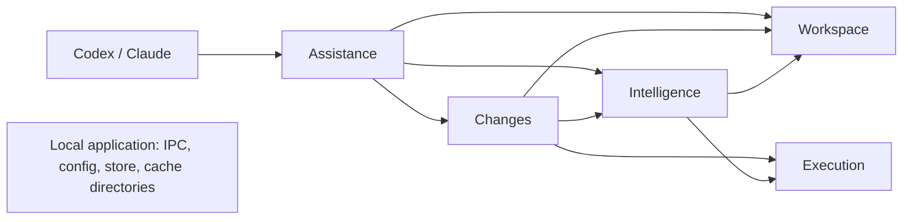

# Architecture

Module boundaries for the planned implementation. Interfaces will be specified under `docs/contracts/` before affected implementation begins. No application source exists yet.

| Component | Responsibility | Proposed owned area | Excludes |
|---|---|---|---|
| Workspace sessions | Trusted binding acceptance, actor/worktree exclusivity, authority generations, Git snapshots and change observations | `src/workspace/` | Host identity discovery, process admission, applying edits |
| Execution | Fair bounded admission, jobs and process ownership, cancellation/reaping, memory/CPU reservations | `src/execution/` | Language semantics, check selection, actor authentication |
| Intelligence | LSP client/profiles, view/backend reuse, capability normalization, semantic context/impact/diagnostics | `src/intelligence/` | OS process supervision, file writes, host delivery |
| Changes | Versioned patches/rename application, recovery journal, check selection/receipts, diff/finish | `src/changes/` | Host delivery, process supervision, semantic server internals |
| Assistance | Codex/Claude adapters, scenario-tool facade, concise renderer and feedback outbox/delivery | `src/assistance/` | Owning worktree state, writing through LSP callbacks, starting unmanaged jobs |
| Application | Local daemon lifecycle/IPC, configuration, SQLite infrastructure, composition, distribution and executable integration entry points | `src/app/`, root manifests and release tooling | Peer domain policies, a second task framework |

One Rust application with a library and binary is the default. Start with modules, not a workspace of tiny crates or a universal actor framework. Root assembly/manifests/shared registration have one owner. Rust stable, edition 2024; Tokio for asynchronous I/O and coordination. Detailed dependency selection and configuration contracts will be recorded with the relevant interfaces.

Do not equate an integration edge with an implementation dependency. A consumer may use an agreed small substitute until the real provider is ready. Actual host authentication, delivery, durability, concurrency and LSP sharing need their own real integration evidence.

## Component contracts

- [Shared vocabulary and failure semantics](contracts/common.md)
- [Workspace authority, snapshots and handoff](contracts/workspace.md)
- [Execution and resource evidence](contracts/execution.md)
- [Intelligence and worktree caches](contracts/intelligence.md)
- [Exact changes and verification](contracts/changes.md)
- [Agent assistance and fail-open hooks](contracts/assistance.md)
- [Local infrastructure](contracts/application.md)

These are runtime relationships, not a serial implementation schedule. Application composes the components. Workspace owns lifecycle identity; persistent analysis cache follows that worktree lifecycle independently of actor/session changes. A failed assistance component cannot veto native agent work.

## v0.3 MVP: project problem feed

[EYES-r2](contracts/eyes-v0.3.md) extends the composed application with a shared per-repository
check service. `src/checks/` owns confined background `cargo check` and pyright runs for admitted
Rust and Python worktrees and one bounded problem snapshot per `(worktree, language)`; Assistance
renders the compact `<agent-ide>` block through Claude post hooks and answers `ide.context` with
`{"kind":"problems"}`; Application hosts the per-repository rendezvous (`/private/tmp/ai-r-…`,
hook key cache `/private/tmp/ai-k-…`) and the persistent check caches under
`$HOME/.agent-ide/checks`. Admission is restart-only launcher configuration (`allowed_roots`,
`project_checks`); every failure is fail-open and never vetoes native agent work. The MVP targets
macOS and Claude; phase 2 adds warm LSP, a launchd per-user service, subagent attach, TypeScript
checks, the Codex active block, and Go checks last.
