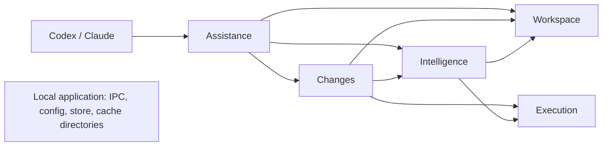

# Architecture

Component and crate boundaries of the implementation. Interfaces are specified under `docs/contracts/` before affected implementation begins. The crate layout and the rule for adding a language are in [Crates](#crates-v05).

| Component | Responsibility | Proposed owned area | Excludes |
|---|---|---|---|
| Workspace sessions | Trusted binding acceptance, actor/worktree exclusivity, authority generations, Git snapshots and change observations | `crates/agent-ide-core/src/workspace/` | Host identity discovery, process admission, applying edits |
| Execution | Fair bounded admission, jobs and process ownership, cancellation/reaping, memory/CPU reservations | `crates/agent-ide-core/src/execution/` | Language semantics, check selection, actor authentication |
| Intelligence | LSP client and the language-server seam, view/backend reuse, capability normalization, semantic context/impact/diagnostics | `crates/agent-ide-core/src/intelligence/`; per-language profiles and backends in `crates/agent-ide-lang-*` | OS process supervision, file writes, host delivery |
| Changes | Versioned patches/rename application, recovery journal, check selection/receipts, diff/finish | `crates/agent-ide-core/src/changes/` | Host delivery, process supervision, semantic server internals |
| Assistance | Codex/Claude adapters, scenario-tool facade, concise renderer and feedback outbox/delivery | `crates/agent-ide-core/src/assistance/` | Owning worktree state, writing through LSP callbacks, starting unmanaged jobs |
| Application | Local daemon lifecycle/IPC, configuration, SQLite infrastructure, composition, distribution and executable integration entry points | `crates/agent-ide-core/src/app/`; the binary, root manifests and release tooling at the root | Peer domain policies, a second task framework |

One application: a language-independent core crate, one crate per language and the root package that assembles them into the `agent-ide` binary (see [Crates](#crates-v05)); no universal actor framework. Root assembly/manifests/shared registration have one owner. Rust stable, edition 2024; Tokio for asynchronous I/O and coordination. Detailed dependency selection and configuration contracts are recorded with the relevant interfaces.

Do not equate an integration edge with an implementation dependency. A consumer may use an agreed small substitute until the real provider is ready. Actual host authentication, delivery, durability, concurrency and LSP sharing need their own real integration evidence.

## Component contracts

- [Shared vocabulary and failure semantics](contracts/common.md)
- [Workspace authority, snapshots and handoff](contracts/workspace.md)
- [Execution and resource evidence](contracts/execution.md)
- [Intelligence and worktree caches](contracts/intelligence.md)
- [Exact changes and verification](contracts/changes.md)
- [Agent assistance and fail-open hooks](contracts/assistance.md)
- [Local infrastructure](contracts/application.md)



These are runtime relationships, not a serial implementation schedule. Application composes the components. Workspace owns lifecycle identity; persistent analysis cache follows that worktree lifecycle independently of actor/session changes. A failed assistance component cannot veto native agent work.

## v0.3 MVP: project problem feed

[EYES-r2](contracts/eyes-v0.3.md) extends the composed application with a shared per-repository
check service. `crates/agent-ide-core/src/checks/` schedules confined background checks and owns
one bounded problem snapshot per `(worktree, language)`; each language crate's `checks` module runs
its checker (`cargo check`, Pyright, `tsc`); Assistance
renders the compact `<agent-ide>` block through Claude post hooks and answers `ide.context` with
`{"kind":"problems"}`; Application hosts the per-repository rendezvous (`/private/tmp/ai-r-…`,
hook key cache `/private/tmp/ai-k-…`) and the persistent check caches under
`$HOME/.agent-ide/checks`. Admission is restart-only launcher configuration (`allowed_roots`,
`project_checks`); every failure is fail-open and never vetoes native agent work. The MVP targets
macOS and Claude; phase 2 adds warm LSP, a launchd per-user service, subagent attach, TypeScript
checks, the Codex active block, and Go checks last.

## Crates (v0.5)

The repository is a Cargo workspace: one language-independent core, one crate per language, and
the root package that assembles them.

| Crate | Path | Owns | Lines |
|---|---|---|---|
| `agent-ide-core` | `crates/agent-ide-core` | Application, Assistance, Workspace, Execution, Changes, feed, telemetry, project card, check scheduling, LSP sessions and the provider seam, and the language contract (`lang`: `Language` registry, `LanguageSupport`, symbols, outlines, edits, rendering, shared `brace`/`text` helpers) | ~58 400 |
| `agent-ide-lang-rust` | `crates/agent-ide-lang-rust` | Rust symbol support, confined `cargo check`, the rust-analyzer profile and backend | ~3 900 |
| `agent-ide-lang-python` | `crates/agent-ide-lang-python` | Python symbol support, confined Pyright checks, the Pyright profile and backend | ~3 900 |
| `agent-ide-lang-typescript` | `crates/agent-ide-lang-typescript` | TypeScript/JavaScript symbol support, confined `tsc` checks, the release-pinned TypeScript profile and backend | ~6 000 |
| `agent-ide-lang-go` | `crates/agent-ide-lang-go` | Go symbol support, the shared-listener gopls profile and backend (no project check) | ~2 800 |
| `agent-ide` (root) | `.` | The `agent-ide` binary (`src/main.rs`), registration of the bundled languages (`agent_ide::languages`), and re-exports of every core and language module under the historical `agent_ide::…` paths | ~3 400 |

Assets, hooks, skills and plugin manifests stay at the repository root. The package version is
declared once in `[workspace.package]` and inherited by every crate, so `env!("CARGO_PKG_VERSION")`
is the product version in each of them.

### Dependency rule

- The core depends on no language crate and names no language, language server or language tool.
  Its behaviour is keyed on a registered `Language` handle, never on a closed enum.
- A language crate depends on `agent-ide-core` only — never on another language crate. Code two
  languages share belongs in the core (`lang::brace`, `lang::text`), written without naming either.
- Only the root package depends on the language crates; it registers them at startup
  (`agent_ide::languages::install()`, called first thing in `main`) and in tests that exercise
  path or id lookups.

`agent-ide-core`'s unit tests `language_free::core_sources_name_no_language` and
`language_free::crate_dependencies_point_only_into_the_core` enforce both rules in the normal
`cargo test --workspace` gate. Core unit tests that need languages use the neutral test languages
in `lang::testing` (`alpha`, `beta`, `gamma` with checks and name-fact stubs, `delta` with
neither).

### How a language plugs in

A language is one static `LanguageDescriptor` (id, display name, file extensions, the manifest
the `ide.start` description names, home tool directories for the formatter `PATH`) that points at
up to four trait implementations:

| Trait | Seam | What the language provides |
|---|---|---|
| `lang::LanguageSupport` | symbol tools | project detection and commands, outline normalization from document symbols, insertion sites, test-file conventions, test selection and output parsing, formatters, module docs, test naming and toolchain pinning, and an optional outline from source (`outline_from_source`) that lets a language without a server answer `ide.outline`, `ide.read`, `ide.symbol` and `ide.graph` (usages and callers then report `unavailable (<id> has no language server; see links)` and `unavailable (<id> has no call hierarchy)`) |
| `checks::LanguageChecks` + `checks::CheckConfig` | project problem feed | presence rule, the `project_checks.<id>` launcher section, the confined `Checker`, doctor probes, an optional sibling-cache seed |
| `intelligence::server::LanguageServer` + `ServerBackend`, and `intelligence::session::SessionProfile` | semantic context and live sessions | the launcher `settings` identifier and extra declaration fields, cache layout, routing extensions, capabilities (call hierarchy, empty-reference answers), the per-worker backend that starts, reuses and reaps servers, and the per-session protocol knobs (configuration, identity check, readiness notification, diagnostics quirks, `didOpen` language id) |
| `lang::names::NameFacts` | cross-language name facts (the language bridge) | the namespaces it may define and use (`coverage`), and a pure per-file `extract` of `(namespace, domain, name)` facts into the core's `FactSink` |

The core reaches all of them through the handle (`language.support()`, `language.checks()`,
`language.server()`, `language.names()`); lookups by path or identifier (`Language::for_path`, `Language::by_id`) and
the order replies list languages come from the registration order.

The fourth seam, `names`, lets languages that cannot see each other agree on shared names. A class
defined by a style rule and used by markup or code, an element id, a style variable: each language
emits define/use facts in core-owned namespaces (`lang::names::ns`), and the core's index
(`intelligence::names`) joins them by `(namespace, domain, name)` across the worktree. Extraction is
a pure function of one file's text — no filesystem, server or subprocess — and a language without a
provider is reported as uncovered, never as "zero uses". See
[the language bridge contract](contracts/language-bridge.md).

### Adding a language (recipe)

The next planned languages are HTML and CSS; the steps are the same for any language. Use the
smallest existing crate as the template: `agent-ide-lang-go` when the language has no project
check, `agent-ide-lang-python` when it does.

1. Create `crates/agent-ide-lang-<name>` with `version.workspace = true`,
   `edition.workspace = true`, `publish = false`, and `agent-ide-core = { path = "../agent-ide-core" }`
   plus only the external crates the code uses. The workspace picks it up through
   `members = ["crates/*"]`.
2. `src/support.rs`: a unit struct implementing `LanguageSupport` (`language()` returns the
   crate's `LANGUAGE`). Start with `detect`, `normalize`, `insert_site` (brace-delimited languages
   reuse `lang::brace::place`) and `is_test_file`; answer `LangError::Unsupported` from
   `test_selection` and `None` from the formatter methods until they exist.
3. Optional `src/checks.rs`: a `LanguageChecks` unit struct (presence rule, tool name,
   `parse_config` for a closed `serde(deny_unknown_fields)` section) and its `CheckConfig`
   (`validate`, `checker`, `programs`) building a `Checker` over the injected `ConfinedRunner`.
4. Optional server: `src/profile.rs` with the accepted server profile implementing
   `SessionProfile`, and `src/backend.rs` with a `LanguageServer` (unique `settings_key`,
   `option_fields`/`parse_options`/`validate_launch` for its launcher fields, cache directories,
   context and session extensions) whose `new_backend` returns the per-worker `ServerBackend`.
   An exclusive stdio server follows `agent-ide-lang-python`'s backend: start on first use, keep
   one `LiveSession` per binding, reap on release.
5. `src/lib.rs`: declare the modules and the registration entry:

   ```rust
   pub static DESCRIPTOR: LanguageDescriptor = LanguageDescriptor {
       id: "<name>",
       display_name: "<Name>",
       extensions: &["<ext>"],
       card_manifest: None,
       home_tool_dirs: &[],
       support: &support::<Name>Support,
       checks: None,
       server: None,
       names: None,
   };
   pub const LANGUAGE: Language = Language::of(&DESCRIPTOR);
   ```

   Extensions must not overlap another registered language's; the identifier must be unique
   (it names the launcher `project_checks` section and the `problems` filter value).
6. Root assembly: add the crate to `[dependencies]` in the root `Cargo.toml`, add its constant to
   `agent_ide::languages::ALL` (registration order is reply order), and re-export its modules in
   `src/lib.rs` if tests or tools address them by path.
7. Run the gate. The core boundary tests fail if anything language-specific leaked into the core.
